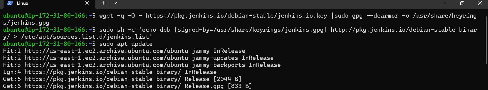
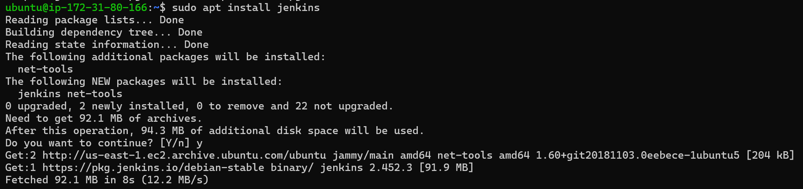
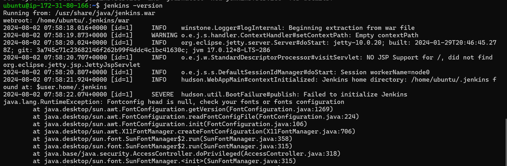

# Installing Jenkins

## Introduction
This is about installing **Jenkins** on Ubuntu 22.04

```bash
wget -q -O - https://pkg.jenkins.io/debian-stable/jenkins.io.key |sudo gpg --dearmor -o /usr/share/keyrings/jenkins.gpg
```
This command downloads and installs the Jenkins public GPG key on a Debian-based Linux system, like Ubuntu. This key is used to verify the authenticity of Jenkins packages.

```bash
sudo sh -c 'echo deb [signed-by=/usr/share/keyrings/jenkins.gpg] http://pkg.jenkins.io/debian-stable binary/ > /etc/apt/sources.list.d/jenkins.list'
```

This command adds the Jenkins repository to your system's list of package sources on a Debian-based Linux distribution, like Ubuntu. 

By adding this repository, you enable your package manager **(apt)** to download and install Jenkins packages from the official Jenkins package repository. This is necessary for installing Jenkins and keeping it updated with the latest versions from the official source.

```bash
sudo apt install jenkins
```


This Command installs **Jenkins** by *apt* Package manager

```bash
 jenkins -version
 ```
 

In this way we can check the jenkins installed sucessfully