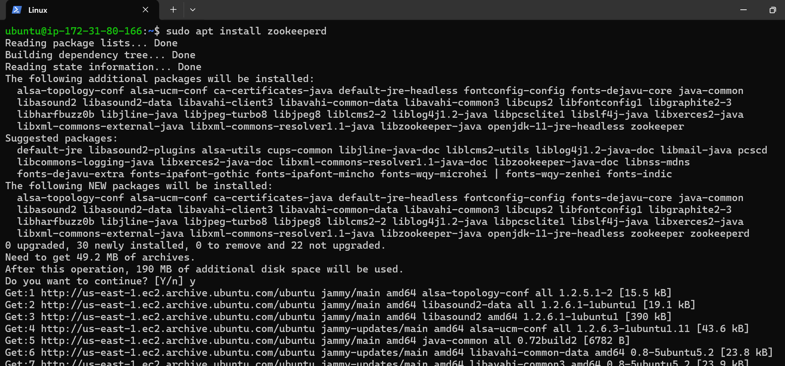
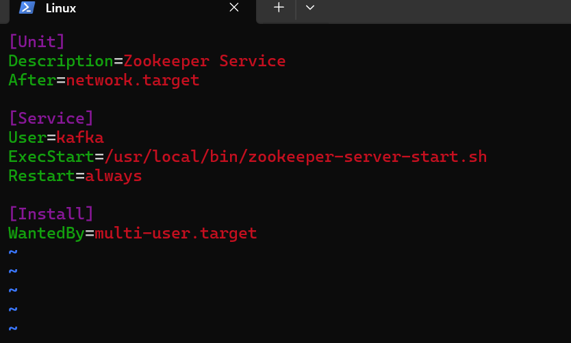
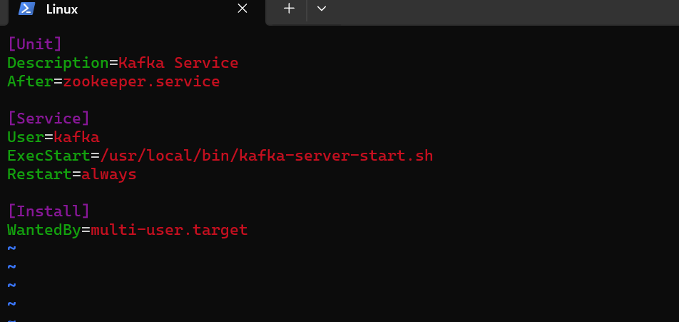
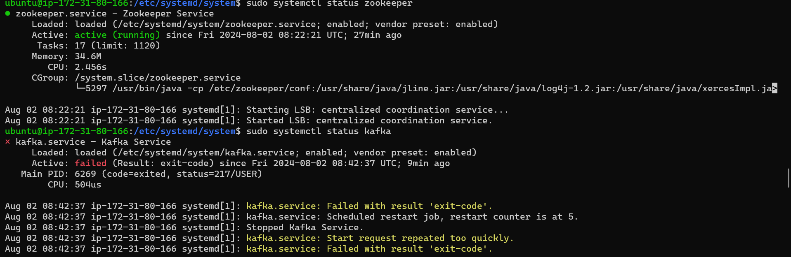

# Installation of Kafka

## Introduction

first ensure java is installed

Install zookeeper 
```bash 
sudo apt-get install zookeeperd
```

Zookeeper is a critical service used in distributed systems like Kafka to coordinate and manage various aspects of the system efficiently.

Create two systemd unit files for Zookeeper and Kafka services. 
For Zookeeper, create a file named <zookeeper.service>
```bash
/etc/systemd/system/zookeeper.service
```

Servicefile:

```bash
[Unit]
Description=Zookeeper Service
After=network.target

[Service]
User=kafka
ExecStart=/usr/local/bin/zookeeper-server-start.sh
Restart=always

[Install]
WantedBy=multi-user.target
```

For Kafka, Create a service file named  <kafka.service>
```bash
/etc/systemd/system/kafka.service
```
service file:

```bash
[Unit]
Description=Kafka Service
After=zookeeper.service

[Service]
User=kafka
ExecStart=/usr/local/bin/kafka-server-start.sh
Restart=always

[Install]
WantedBy=multi-user.target
```
Reload systemd daemon and start Zookeeper and Kafka services:

```bash
sudo systemctl daemon-reload
sudo systemctl start zookeeper
sudo systemctl start kafka
```
now check the status of both

```bash
sudo systemctl status zookeeper
sudo systemctl status kafka
```

## Screenshots




