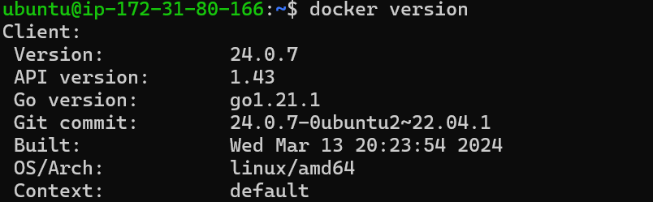

# Installation of Docker

## Introduction
Installing **Docker** on Ubuntu 22.04

Install Docker using *apt* package using command 

```bash
sudo apt install docker.io
```


To check docker version excecute the following command

```bash
docker version
```


In this way we can install Docker on Ubuntu 22.04

