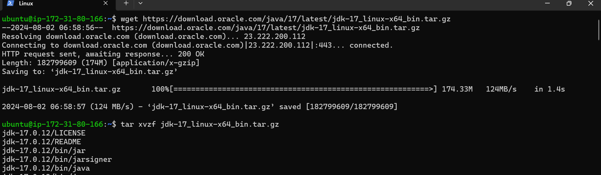
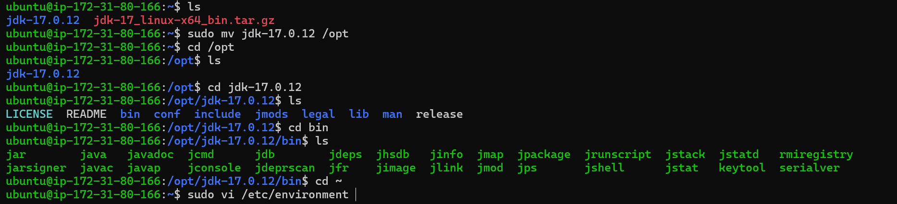
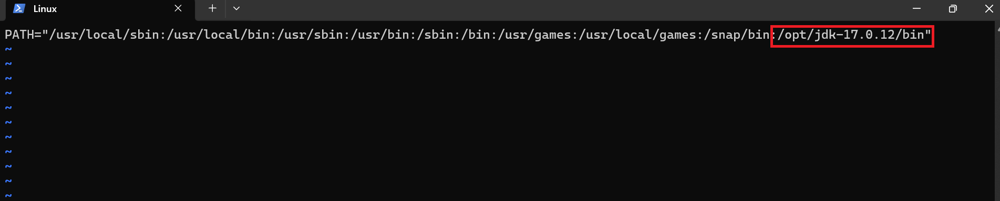
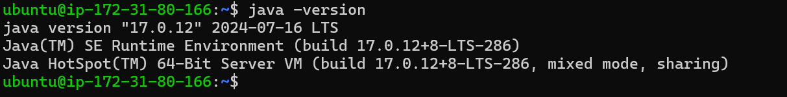

# Installing java 

## Introduction
 This is about installing **Openjdk 17** on Ubuntu 22.04

first copy the tar file [Referhere](https://www.oracle.com/java/technologies/downloads/#java17)
Now follow the command

```bash
wget <"java version tar file">
 
tar xvzf jdk-17_linux-x64_bin.tar.gz 
```


here we got the tar file and untar that file by excecuting the above commands

now we need to move untar file to /opt folder
```bash
 sudo mv jdk-17.0.12 /opt
```


now set the path by the following command

```bash
 sudo vi /etc/environment
```
add the path " :/opt/jdk-17.0.12/bin "


now exit and relogin 
Now check for java version to check if the java installed correctly or not
```bash
java -version
```


we can see java installed sucessfully

