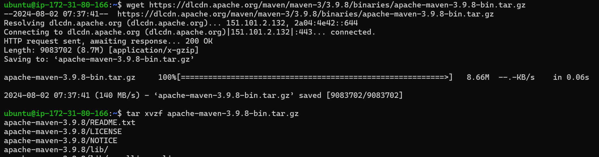
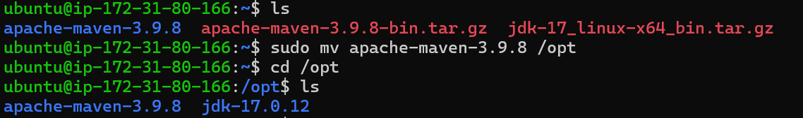
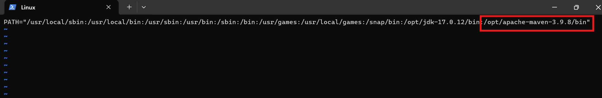
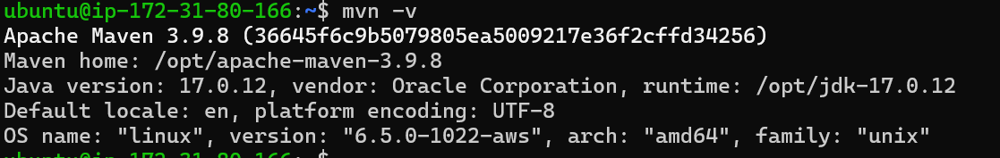

# Installing Maven

## Introduction
 This is about installing **maven** on Ubuntu 22.04

 Inorder to install **Maven** check there is **java** installed 

first copy the tar file [Referhere](https://maven.apache.org/download.cgi)
Now follow the command

```bash
wget <"maven version tar file">
 
tar xvzf apache-maven-3.9.8-bin.tar.gz 
```


here we got the tar file and untar that file by excecuting the above commands

now we need to move untar file to /opt folder
```bash
 sudo mv apache-maven-3.9.8 /opt
```


now set the path by the following command

```bash
 sudo vi /etc/environment
```
add the path " :/opt/jdk-17.0.12/bin "


now exit and relogin 
Now check for maven version to check if the maven installed correctly or not
```bash
mvn -v
```


we can see **Maven** installed sucessfully

