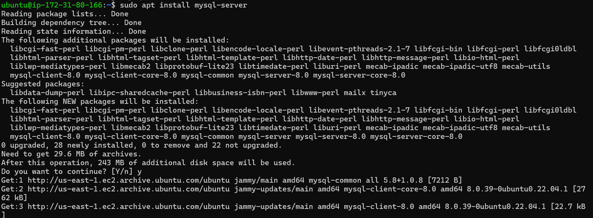
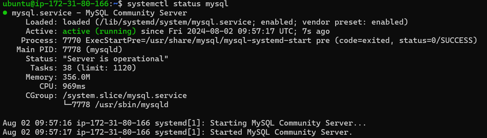

# Installation of Mysql

## Introduction
Install **Mysql** on ubuntu 22.04

Update the machine by the following command
```bash
sudo apt update -y
```
Install mysql using apt package
```bash
sudo apt install mysql-server
```


Check the status of sql to check weather sql is running or not using command

```bash
systemctl status mysql
```


If the service is not active use following commands to start the mysql server

```bash
sudo systemctl start mysql
sudo systemctl enable mysql
```
To check the sql version run the following command

```bash
mysql -V
```


In this way we can install Mysql on Ubuntu 22.04
